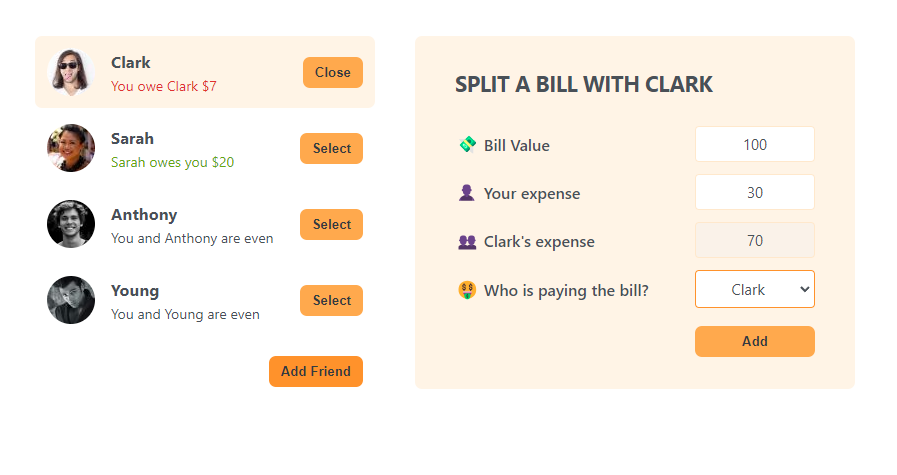

  

---

# Eat N Split (Practice Application)

## Description



This is a practice React application that allows users to add friends, split the bill, and record who owes who how much. User can also add a new friend to the list of friends. The main goal of this project was to get a grasp of React components. This application is not deployed on the web. Please see the installation section below to run the application on your local machine.

```bash
npm run start
```

---

## Table of Contents

- [Installation](#installation)
- [Usage](#usage)
- [Credits](#credits)
- [Contributing](#contributing)
- [Tests](#tests)
- [Questions](#questions)

---

## Installation

You will have to run this program in your terminal.

To install necessary dependencies (inquirer module, etc), run the following command:

```bash
npm i
```

---

## Usage

This application runs on web browsers. To run the application, run the following command:

```bash
npm start
```

A web browser should open up with the application. If not, open a web browser and go to http://localhost:3000.

As this application is a practice application, it uses data specified in App.js. If you wish to change this, please update initialFriends array with your own data following the same format. If you are okay with the data already there, then you can start using the application right away.

---

## Credits

Thank you, Jonas Schmedtmann, for providing amazing CSS styles, React guides and instructions!

---

## Contributing

For contributions, please create a new branch of the project and submit a pull request. Any contributions are greatly appreciated. Issues can be submitted in the issues section of the repo or by emailing me directly (see Questions section below).

---

## Tests

Test feature is not available at this time.

---

## Questions

If you have any questions about the repo, open an issue or contact me directly at:

Github: [jyoungjoon](https://github.com/jyoungjoon)

Email: lifescriptified@gmail.com

---
